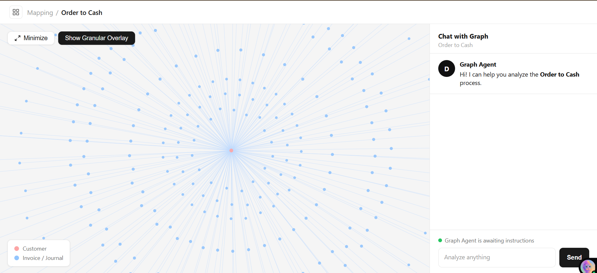

# 🔍 DodgeAI — Conversational SAP Order-to-Cash Analytics

> Ask questions about your SAP O2C data in plain English. Get SQL results, graph traces, and business insights — instantly.

**[🚀 Live Demo](https://dodgeai-project.onrender.com)** &nbsp;|&nbsp; **[GitHub Repo](https://github.com/VaishnaviShinde5/DodgeAI_Project)**

---

## What It Does

DodgeAI is an AI-powered query interface over SAP Order-to-Cash (O2C) data. Instead of writing SQL or navigating complex ERP dashboards, you just ask:

- *"Which customers have the highest total billed amount?"*
- *"Find deliveries with no matching invoice"*
- *"Trace billing document 90504248"*

The system figures out whether to run a SQL query or trace a graph path — and gives you a clean answer.

---
## 🖼️ Screenshots

### 



---

## Architecture

```
┌─────────────────────────────────────────────────────┐
│              Frontend (HTML + D3.js)                │
│   Graph Visualization  │  Conversational Chat UI   │
└────────────────┬───────────────────┬────────────────┘
                 │  REST API         │
┌────────────────▼───────────────────▼────────────────┐
│               FastAPI Backend (Python)              │
│                                                     │
│   /graph endpoint          /query endpoint          │
│   NetworkX DiGraph          Guardrail check         │
│                                  ↓                  │
│                        "trace" keyword?             │
│                         ↓          ↓               │
│                   Graph BFS     LLM (Groq)         │
│                                → SQL → SQLite      │
└─────────────────────────────────────────────────────┘
                         │
┌────────────────────────▼────────────────────────────┐
│             SQLite Database (data.db)               │
│  invoices │ sales_orders │ deliveries │ payments   │
│  journals │ products │ business_partners │ plants  │
└─────────────────────────────────────────────────────┘
```

---

## Tech Stack

| Layer | Choice | Why |
|-------|--------|-----|
| Backend | FastAPI (Python) | Fast async API, auto Swagger docs |
| Database | SQLite | Zero setup, file-based, full SQL |
| Graph | NetworkX DiGraph | Lightweight, Pythonic, no external server |
| Graph UI | D3.js force simulation | Interactive, industry standard |
| LLM | Groq (LLaMA 3.1 8B) | Free tier, fast inference, reliable JSON output |

---

## How It Works

### 1. Natural Language → SQL
User asks a question → LLM generates a SQLite query → results returned as a table.

The LLM is given the full schema, SQLite-specific rules, and 5 few-shot examples. Output is post-processed to strip markdown, fix quoting issues, and validate it's a SELECT statement.

### 2. Graph Trace (keyword: "trace")
If the query contains "trace", a BFS traversal runs on the NetworkX graph instead of hitting the LLM — faster, deterministic, no API cost.

**O2C Flow modeled:**
```
Customer → Sales Order → Delivery → Invoice → Journal Entry → Payment
```

### 3. Guardrail System
Queries go through a 3-layer filter before reaching the LLM:
- **Blocklist** — rejects off-topic keywords (weather, jokes, recipes, etc.)
- **Allowlist** — requires at least one O2C domain keyword
- **Gibberish detection** — rejects very short or vowel-free inputs

This saves latency and API cost on irrelevant queries.

---

## Database Schema

| Table | Source Data | Key Fields |
|-------|-------------|------------|
| `invoices` | billing_document_headers | billingDocument, soldToParty, totalNetAmount |
| `sales_orders` | sales_order_headers | salesOrder, soldToParty, netAmount |
| `deliveries` | outbound_delivery_headers | deliveryDocument, salesOrder, plant |
| `payments` | payments_accounts_receivable | paymentDocument, soldToParty, amount |
| `journals` | journal_entry_items_AR | accountingDocument, billingDocument |
| `products` | products | product, productType, productGroup |
| `business_partners` | business_partners | businessPartner, businessPartnerName |
| `plants` | plants | plant, plantName, country |

---

## Example Queries

| Query | Type | Result |
|-------|------|--------|
| `Which customer has the highest total amount?` | SQL | Customer with max billed amount |
| `Show top 10 invoices by amount` | SQL | Ranked invoice list |
| `Find invoices with no journal entry` | SQL | Broken O2C flows |
| `Find deliveries with no matching invoice` | SQL | Unbilled deliveries |
| `Trace billing document 90504248` | Graph BFS | Full O2C path for that document |
| `Tell me a joke` | Guardrail | ❌ Off-topic rejection |

---

## API Reference

| Method | Endpoint | Description |
|--------|----------|-------------|
| GET | `/` | Serves frontend UI |
| GET | `/health` | Health check |
| GET | `/graph` | All nodes and edges as JSON |
| POST | `/query` | `{"question": "..."}` → typed response |

**Response types:**

```json
// SQL result
{
  "type": "sql_query",
  "sql": "SELECT ...",
  "columns": ["billingDocument", "totalNetAmount"],
  "result": [["90504243", 2033.65]]
}

// Graph trace
{
  "type": "graph_trace",
  "flow": {
    "start": {"type": "Invoice", "id": "91150187"},
    "next_steps": [{"type": "Journal Entry", "id": "9400635958"}],
    "summary": "Invoice 91150187 → Journal Entry 9400635958"
  }
}

// Guardrail triggered
{
  "type": "guardrail",
  "answer": "This system answers SAP Order-to-Cash questions only."
}
```

---

## Running Locally

```bash
# 1. Clone the repo
git clone https://github.com/VaishnaviShinde5/DodgeAI_Project
cd DodgeAI_Project/backend

# 2. Install dependencies
pip install -r requirements.txt

# 3. Set your API key
cp .env.example .env
# Edit .env → add your GROQ_API_KEY

# 4. Start the server (also serves frontend)
uvicorn main:app --reload

# 5. Open in browser
# http://localhost:8000
```

One command. One port. Full app — no separate frontend server.

---

## Project Structure

```
DodgeAI_Project/
├── backend/
│   ├── main.py          # FastAPI app, routes, data loading
│   ├── db.py            # SQLite schema + connection
│   ├── graph.py         # NetworkX graph construction
│   ├── llm.py           # Groq LLM integration + SQL generation
│   ├── utils.py         # JSONL folder loader
│   └── requirements.txt
├── frontend/
│   └── index.html       # Single-file UI: D3 graph + chat
├── data/
│   └── sap-o2c-data/    # Raw JSONL dataset (8 entity types)
└── README.md
```

---

## Tradeoffs & What I'd Improve With More Time

- **Graph DB (Neo4j/ArangoDB):** For multi-hop path queries and subgraph patterns, a native graph DB would be more expressive than NetworkX + SQLite
- **Streaming responses:** Groq supports streaming; adding it would make the chat feel more real-time
- **Conversation memory:** Currently stateless — each query is independent. Message history would enable follow-up questions
- **Embedding-based guardrail:** The current keyword approach can be gamed. Intent classification via embeddings would be more robust
- **Node highlighting:** Highlight graph nodes referenced in chat responses
- **Vector search:** Fuzzy matching for product/customer names

---

## Author

**Vaishnavi Shinde** — AI / ML Enthusiast  
Interested in LLMs, AI agents, and intelligent data systems

⭐ If this was useful, consider starring the repo!
